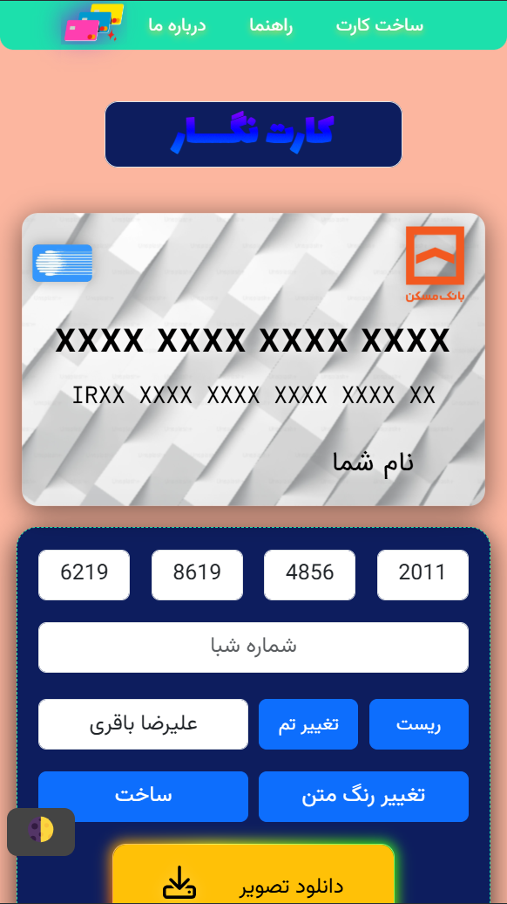
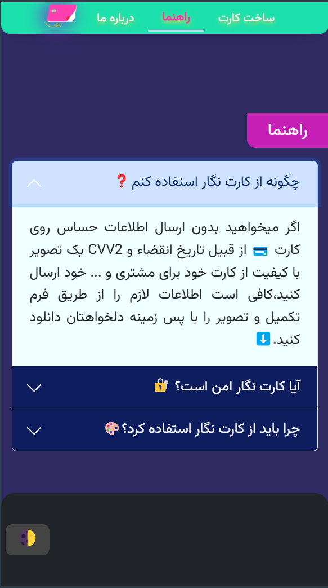

# Card-Face-Generator


<div dir="ltr">
A useful tool designed for individuals who need to share their card numbers with customers, but want to ensure the security of CVV2 and expiration date information.

This tool is intended solely for educational and daily use purposes. Please refrain from using it for any other
activities. I have invested numerous hours into developing this project and would not be pleased if someone uses this
code for personal gain.

[Demo](https://alireza-baqeri.github.io/Card-Face-Generator/)
</div>

<div dir="rtl">

## مستندات پروژه کارت‌نگار

### معرفی

کارت‌نگار یه ابزار وب برای ساخت تصویر کارت بانکی بدون اطلاعات حساس (مثل CVV2 یا تاریخ انقضا) هست. کاربران می‌تونن شماره
کارت، شماره شبا و نام خودشون رو وارد کنن، تم کارت رو تغییر بدن، رنگ متن رو عوض کنن و تصویر کارت رو با کیفیت بالا دانلود
کنن. این پروژه برای اهداف آموزشی و استفاده‌های تجاری ساده طراحی شده.
<br>
[کارت نگار 💳](https://alireza-baqeri.github.io/Card-Face-Generator/)

### نصب و راه‌اندازی

1. مخزن رو کلون کنید:
   ```bash
   git clone https://github.com/alireza-baqeri/Card-Face-Generator
   ```
2. به پوشه پروژه برید:
   ```bash
   cd Card-Face-Generator
   ```
3. یه سرور محلی راه بندازید (مثل Live Server در VS Code ).
4. پروژه رو توی مرورگر باز کنید (مثل `http://localhost:8000`).


### چیزایی که استفاده کردم

- Bootstrap 5.3.5 (CSS و JS)
- Font Awesome (برای آیکون‌ها)
- html2canvas 1.4.1 (برای دانلود تصویر)

<div dir="rtl">
(البته می‌تونید با clone کردن این پروژه روی WebStorm به صورت لوکال این فریم‌ورک‌ها و کتابخونه‌ها رو دانلود کنید)
</div>

### تصاویری از ظاهر پروژه

<table>
  <tr>
    <td></td>
    <td></td>
  </tr>
  <tr>
    <td></td>
    <td></td>
  </tr>
</table>

### استفاده

#### وارد کردن اطلاعات ℹ️

- شماره کارت رو توی 4 فیلد (هر کدوم 4 رقم) وارد کنید.
- شماره شبا (ℹ️ اختیاری، 24 رقم ℹ️) رو وارد کنید.
- نام و نام خانوادگی رو بنویسید.

#### ساخت کارت

- روی دکمه "ساخت" کلیک کنید. اگه اطلاعات درست باشه، کارت با لوگو بانک آپدیت می‌شه.

#### تغییر تم و رنگ

- دکمه "تغییر تم" برای عوض کردن پس‌زمینه کارت.
- دکمه "تغییر رنگ متن" برای تغییر رنگ متن‌های کارت.

#### دانلود تصویر

- بعد از ساخت کارت، روی "دانلود تصویر" کلیک کنید تا تصویر PNG ذخیره بشه.

#### ریست

- دکمه "ریست" همه فیلدها و تنظیمات رو به حالت اولیه برمی‌گردونه.

<div dir="rtl">
این دکمه تست شده و درست کار می‌کنه، اما اگر به مشکلی برخوردید، کافیه صفحه رو رفرش کنید.
</div>

### ساختار پروژه


- `docs/README.md`: مستندات پروژه.
- [GitHub Repository](https://github.com/alireza-baqeri/Card-Face-Generator)

</div>
